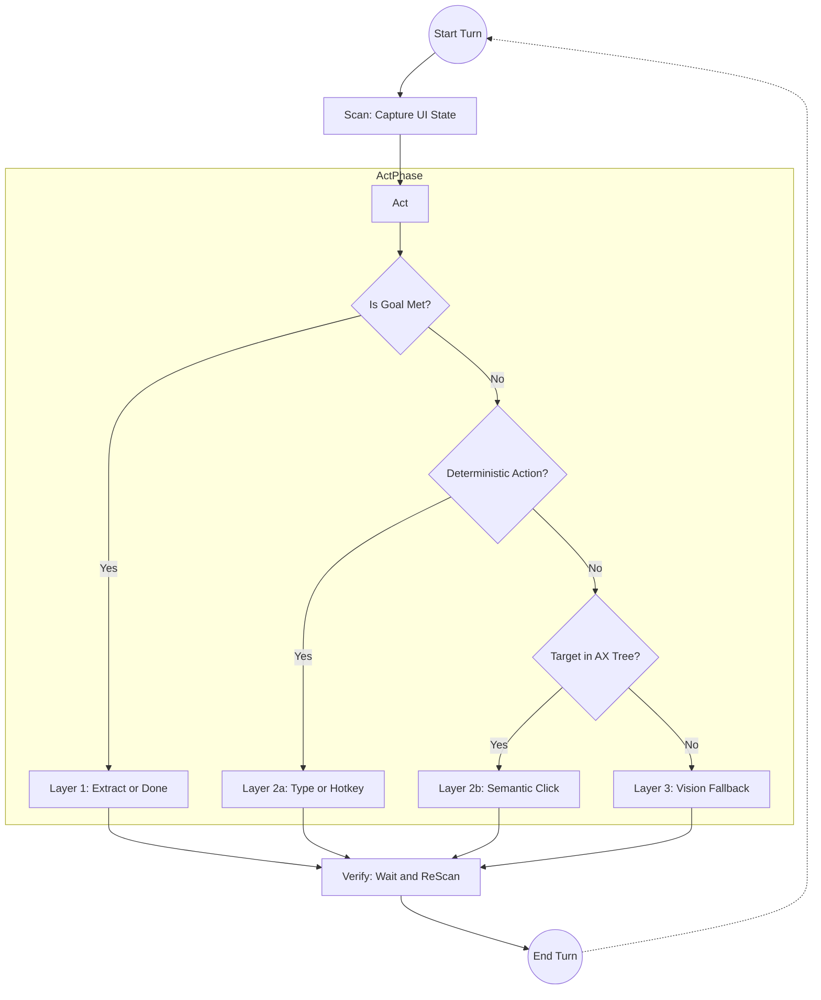

# AutoDesktopController Architecture & Nuances

This document captures the core architectural patterns, execution loops, and critical nuances of the desktop and browser agents within the AutoDesktopController project.

## 1. The 4-Layer Architecture

Both the browser and desktop skills utilize a cascading, 4-layer strategy. The system attempts to resolve a task at the lowest (cheapest, fastest, most reliable) layer possible before escalating to more complex and expensive methods.

*   **Layer 1: Extract / Done (Pure Text/HTML)**
    *   **Concept:** The agent simply reads the current state (e.g., the Accessibility (AX) Tree or HTML) and realizes the goal is already met or the required information is present.
    *   **Action:** No interaction occurs. The agent extracts the necessary data and returns a `done` status.
*   **Layer 2a: Deterministic Execution**
    *   **Concept:** Direct, known actions that don't require semantic search, such as typing a specific string of text (`type_text`) or pressing a known hotkey (`key`).
    *   **Action:** Bypasses complex spatial locating. This is the preferred method for entering values or submitting forms once a field is focused.
*   **Layer 2b: Semantic AX Tree Interaction**
    *   **Concept:** The core interaction loop. The agent is provided a text-based representation of the UI (an AX tree for desktop, or an interactive element legend for browser) without a screenshot.
    *   **Action:** The LLM parses the tree and selects an `element_index` to interact with (e.g., click). This is significantly cheaper and faster than vision models.
*   **Layer 3: Vision Fallback (Set-of-Marks)**
    *   **Concept:** If the target element is obscured, missing from the AX tree, or highly custom (like a canvas), the agent escalates to Layer 3.
    *   **Action:** A screenshot is taken, interactive elements are visually annotated with numbered bounding boxes, and a Vision-capable LLM determines the action based on the visual representation.

## 2. How the Layers Map to the Scan-Act-Verify Loop

The 4-layer architecture does not sit *around* the loop; rather, it is dynamically evaluated **inside the "Act" phase** of the Scan-Act-Verify loop on every single turn. 

Here is how they are linked:
1. **Scan**: The environment state is captured (e.g., getting the AX Tree).
2. **Act (Layer Selection)**: The LLM analyzes the scanned state and **chooses one of the 4 layers** to execute the next step.
   - Goal achieved? -> Choose **Layer 1**
   - Need to type? -> Choose **Layer 2a**
   - Need to click a semantic element? -> Choose **Layer 2b**
   - Can't find the target in the tree? -> Choose **Layer 3**
3. **Verify**: A new scan is taken to ensure the chosen layer's action succeeded.

## 3. The Scan-Act-Verify Loop

Tasks are executed via a strict `Scan -> Act -> Verify` loop to ensure reliable state transitions.

### Phase A: Scan
*   The agent queries the environment for its current state (e.g., `get_window_state` via the CUA daemon for desktop).
*   **Edge Case:** If the returned tree is empty (element count is 0), the system immediately recognizes a failure in the semantic layer and prepares to escalate to Layer 3 (Vision).
*   **Nuance:** AX trees can be massive. The tree markdown is typically truncated (e.g., to 25,000 chars) to prevent context window overflow and manage LLM costs.

### Phase B: Act (Perception & Routing)
*   The LLM is prompted with the current subgoal, the history of recent actions, and the truncated tree/legend.
*   The LLM must output *exactly one* JSON object dictating the chosen layer and the action to take.
*   **Nuance:** The prompt strictly enforces that subgoals are defined as **STATES to achieve** (e.g., "The text is entered"), rather than blind instructions (e.g., "Press a button"). This definition makes it easier for the LLM to know when to output `action: done`.

### Phase C: Verify
*   After the action is dispatched via the driver, the system briefly sleeps to allow the UI to settle.
*   The system performs a re-scan of the AX tree.
*   This updated state serves as the `Scan` phase for the next turn, allowing the LLM to verify if its previous action achieved the desired state transition.

## 3. Important Nuances & Edge Cases

### Desktop Specifics
*   **Window Resolution:** Launching an app isn't enough; the agent must reliably resolve the `pid` and `wid` (Window ID). This involves a polling retry loop inspecting window titles.
*   **macOS Background Trap:** On macOS, launching an app via PID sometimes leaves it in the background. The agent utilizes an explicit `osascript` fallback to force the application to activate and come to the foreground.

### Browser Specifics
*   **Gateway Blocking:** The browser agent actively scans the raw HTML for CAPTCHAs, Cloudflare interstitials, and Login Walls. Hitting these is treated as a "first-class failure" (`gateway_blocked`), immediately halting the cascade and deferring to the orchestrator's recovery path.
*   **Transient Elements (Dropdowns):** When an LLM decides to click a dropdown trigger, it must be the *single* action taken that turn. Bundling a secondary click in the same turn will fail because the dropdown options do not exist in the DOM until the next `Scan` phase.

### Orchestration & LLM Routing
*   **Framework-Free Client:** The system avoids heavy SDKs (like LangChain), opting for a lightweight `httpx` client hitting a local gateway (`localhost:8109`). This keeps the agent layer fast and separates concern: the gateway handles provider routing, retries, and ledger attribution.
*   **Goal Decomposition:** Before the execution loop begins, a high-level goal is passed to an LLM to be broken down into discrete subgoals. The orchestration relies heavily on this breakdown to keep the `Scan-Act-Verify` loops focused and manageable.
